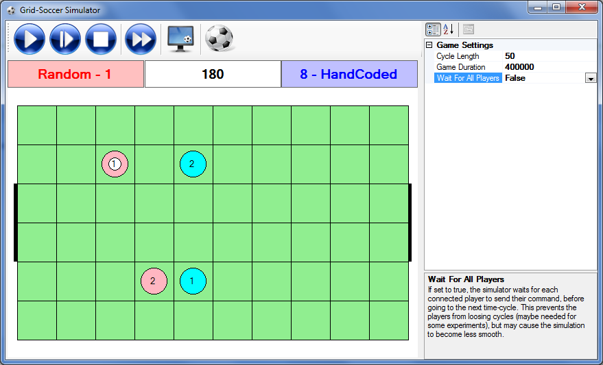
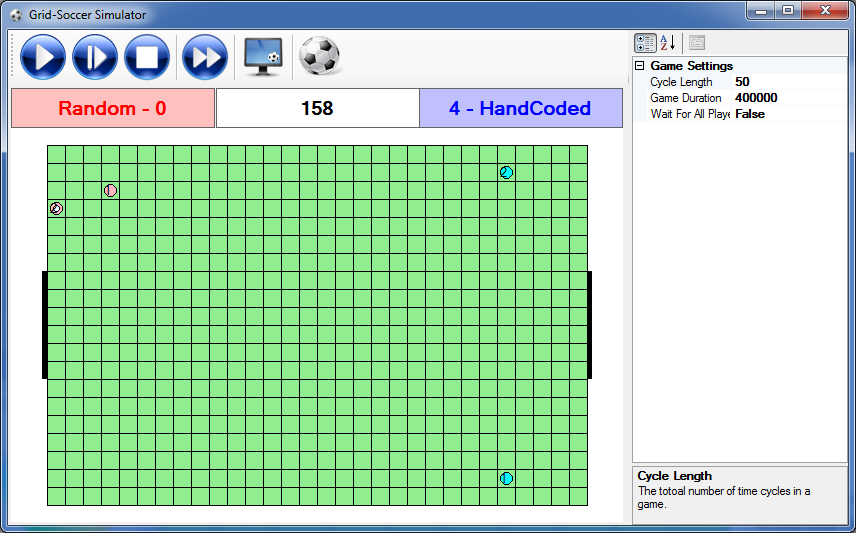
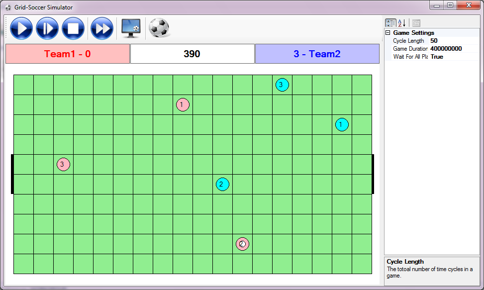

# Grid-Soccer Simulator and Agents

Grid-Soccer Simulator is a multi-agent soccer simulator in a grid-world environment. The environment provides a test-bed for machine-learning, and control algorithms, especially multi-agent reinforcement learning.

Grid-soccer simulator has been hosted in [CodePlex](https://gridsoccer.codeplex.com/) since its inception at 2011, and is now moved to [GitHub](https://github.com/sinairv/GridSoccerSimulator) as a result of CodePlex shutting down.

## Dependencies

You need [mono](http://www.mono-project.com) (available for all platforms) or .NET Framework to run the simulator and the sample clients.

## Features

* The communication between players and the simulator is performed using a human-readable, plain text, network protocol; hence one can create a player in virtually any programming language that supports networking
* Several C# agents, C++, Java, and Matlab sample agents
* Change almost every aspect of the simulator using the simulator's settings file (located in `/Bin/GridSoccerSimulator.exe.config`; the settings file is an XML file which can be easily edited using an ordinary text-editor)
* Agents implementing
  * Dynamic Programming 
  * *Q*-Learning
  * SARSA
  * *Q*-Learning lambda with naive and Watkins implementation
  * an evolutionary learning agent implemeting *HyperNEAT*
  * different Modular Reinforcement Learning implementations
  * a hand-coded greedy agent to test different algorithms against
  * a random client that plays on random basis
  * a text client to test the communication protocol
  * a C++ basic client
  * a Java basic client
  * a MATLAB basic client
* Connect any desired number of players for each team as specified in the simulator settings file
* Change the dimension of the field and the goal-width as desired (as specified in the simulator settings file)
* Change the passable distance of each player
* Change the view distance of each player
* and more... 

## User's Manual

Please read the user's manual to get started with the contents of the source package, and basic functionalities of the simulator and the agents. The manual also contains information about the communication protocol between the simulator and the clients, and formalizes the model of the dynamics of the environment. Download the manual from [here](ReadMeFiles/GridSoccerManual.pdf).


## Quick Start

* _Build the source files._ Having downloaded the source code, build the source files by opening the `AllInOne.sln` solution file and choosing build in the IDE (Microsoft Visual Studio or SharpDevelop).

* _Run the executables._ Having built the source files successfully, go the `Bin` folder. There you can find the executables for the simulator and the sample clients. 

* _Adjust the simulator configs._ In the `Bin` folder there exists a file named `GridSoccerSimulator.exe.config`, which is a plain text file containing the simulator configs formatted as XML. There you can modify various parameters of the simulator including the cycle length in milliseconds, the total number of cycles of each game, the dimensions of the field, the width of the goal, the minimum, and maximum number of players in the game, the passability and visibility radii for each player, and others. If the simulator is already running you need to restart it, in order for the changes to take effect.

* _Use a script to start a game._ In the _Scripts_ folder, there exists a couple of sample scripts to demonstrate how a game and the players for the 2 teams should be started. You may want to run _RandomVsHandCoded.bat_ to start, or modify it as you wish. If you are using *Mono* instead of .NET Framework, you can use `Mono - RandomVsHandCoded.bat` instead. Note that, in order for the latter script to work, you have to add the path to the mono executable in your system's `PATH` environment variable.

* _Use turbo mode to increase speed of the simulation._ There are times, that some experiments need days of simulation. In such cases the *turbo mode* can be of great help. In turbo mode, there's no time-gap between two consecutive cycles, hence the CPU usage of your system might be greatly increased. You can also turn the monitor off to further increase performance, and turn it back on whenever needed.

## Screen-shots

A game in the Grid-Soccer Simulator in a grid of 10 x 6 cells.



A game in the Grid-Soccer Simulator in a grid of 20 x 30 cells, and goals of width 6 cells.



A game in the Grid-Soccer Simulator with 3 agents playing at each side in a grid of 10 x 18 cells, and goals of width 2 cells.



## Cite Grid-Soccer Simulator

If you are using this environment in your research, please cite the Grid-Soccer User's Manual in your related publications using the following BibTeX entry:

```bibtex
@Manual{gsman11,
   title = {Grid Soccer Simulator 1.0: User's Manual},
   author = {Sina Iravanian and Sahar Araghi},
   month = {April},
   year = {2011},
   note = "http://gridsoccer.codeplex.com",
   url = "http://gridsoccer.codeplex.com"
}
```

## License

[MIT](Copying.txt)
